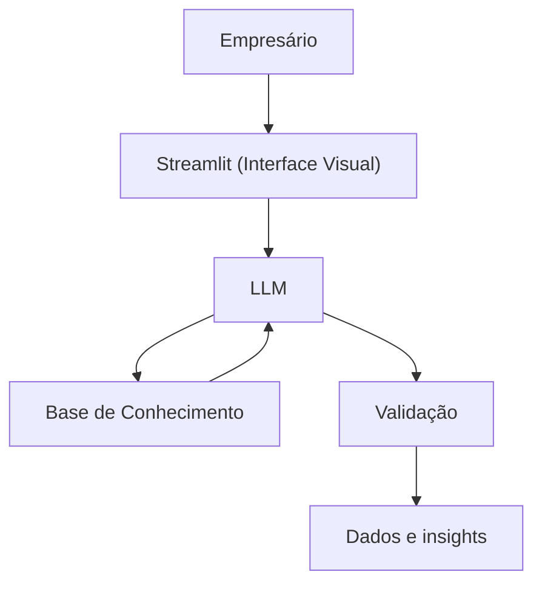

# 🎓 Edu - Educador Financeiro Inteligente

> Agente de IA Generativa que ensina conceitos de finanças pessoais de forma simples e personalizada, usando os próprios dados do cliente como exemplos práticos.

## 💡 O Que é o Edu?

O Edu é um educador financeiro que **ensina**, não recomenda. Ele explica conceitos como reserva de emergência, tipos de investimentos e análise de gastos usando uma abordagem didática e exemplos concretos baseados no perfil do cliente.

**O que o Edu faz:**
- ✅ Explica conceitos financeiros de forma simples
- ✅ Usa dados do cliente como exemplos práticos
- ✅ Responde dúvidas sobre produtos financeiros
- ✅ Analisa padrões de gastos de forma educativa

**O que o Edu NÃO faz:**
- ❌ Não recomenda investimentos específicos
- ❌ Não acessa dados bancários sensíveis
- ❌ Não substitui um profissional certificado

## 🏗️ Arquitetura



**Stack:**
- Interface: Streamlit
- LLM: Claude Opus
- Dados: Arquivos JSON

## 📁 Estrutura do Projeto

```
├── data/                          # Base de conhecimento
│   ├── empresa.json          # Ambiente e contexto do usuário final
│   ├── perfil_empresario.csv # Perfil do usuário final
│   └──  funcionarios.csv      # Funcionarios da empresa
│ 
│
├── docs/                          # Documentação completa
│   ├── 01-documentacao-agente.md  # Caso de uso e persona
│   ├── 02-base-conhecimento.md    # Dados e de como são processados
│   ├── 03-prompts.md              # System prompt e casos de teste
│   ├── 04-metricas.md             # Avaliação de qualidade
│   └── 05-pitch.md                # Apresentação do projeto
│
└── src/
    └── app.py                     # Aplicação Streamlit
```

## ▶️ Instalações e executar

### 1. Instalar Dependências

```bash
pip install streamlit pandas requets anthropic
```

### 3. Rodar o Gigante

```bash
streamlit run src/app.py
```

## 🎯 Casos de Uso

**Usuário:**
```
"Quais são as melhores épocas do ano para elevarmos o nosso marketing de velas artesanais?"
```
**Gigante:**
```
"De acordo com a sua área de negócio e com os dados estatísticos, é recomendado que haja uma maior divulgação de velas artesanais nos meses de Novembro e Dezembro, estima-se que cerca de 30% a 35% de todas as vendas anuais desse setor aconteçam especificamente nesse período de fim de ano, em celebração ao dia de Finados e a Véspera de Natal."
```

**Usuário:**
```
"Quais são os produtos e serviços mais vendidos no bairro de Tambaú?"
```
**Gigante:**
```
"Os principais serviços oferecidos no bairro Tambaú seriam os serviços de turismo e gastronomia, devido ao grande número de quiosques e viagens que são ofertados na praia de Tambaú. 
```

## 📊 Métricas de Avaliação

| Métrica | Objetivo |
|---------|----------|
| **Assertividade** | O agente responde o que foi perguntado? |
| **Segurança** | Evita inventar informações (anti-alucinação)? |
| **Coerência** | A resposta é adequada ao perfil do cliente? |

4. **Teste cenários reais:** Simule perguntas que um cliente faria de verdade
5. **Seja direto no pitch:** 3 minutos passam rápido, vá ao ponto
