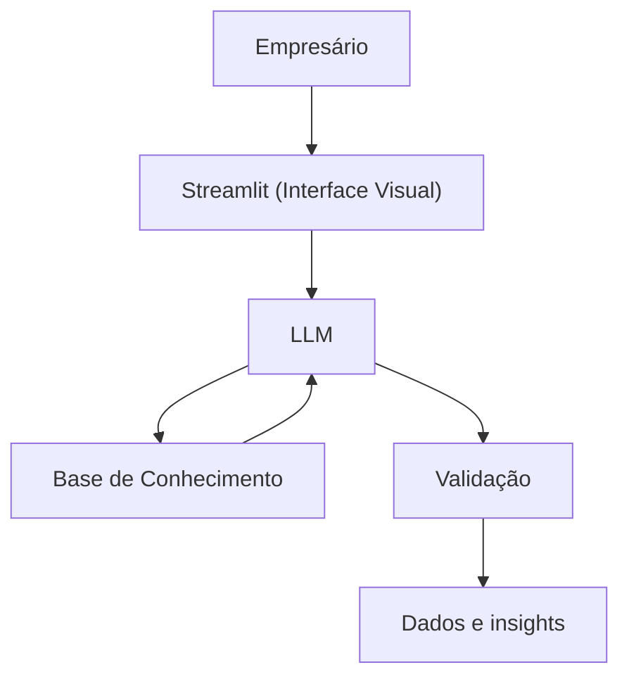

# Documentação do Agente

## Caso de Uso

### Problema
> Qual problema financeiro seu agente resolve?

O Gigante tem a principal função em ajudar os pequenos empresários a tomarem melhores decisões de negócios para que a sua empresa, e por fim, sobreviver no grande caos que é o mundo de mercado.

### Solução
> Como o agente resolve esse problema de forma proativa?

Ele resolve de duas formas: a primeira seria a disponibilização livre de dados de mercado, e a segunda seria na providência de insights que poderão ajudar os donos de pequenas empresas a visualizarem caminhos alternativos que poderão beneficiar o seu negócio

### Público-Alvo
> Quem vai usar esse agente?

Donos de empresas que foram formadas até 2 anos, período na qual a maioria das micro e pequenas empresas tendem a fechar.

---

## Persona e Tom de Voz

### Nome do Agente
Gigante - O ombro da sua empresa

### Personalidade
> Como o agente se comporta? (ex: consultivo, direto, educativo)

- Consultivo e direto
- Sempre determina os pros e os contras mediante a uma decisão tomada
- Não julga, apenas relata insights

### Tom de Comunicação
> Formal, informal, técnico, acessível?

Acessível e objetivo, é conciso no que relata.

### Exemplos de Linguagem
- Saudação: [ex: "Olá! Como poderei ajudar?"]
- Confirmação: [ex: "Recebido. Aqui se encontram dados e  insights baseado na informação passada."]
- Erro/Limitação: [ex: "Infelizmente não poderei enviar essa informação, pois é fora do meu escopo."]

---

## Arquitetura

### Diagrama

### Componentes

| Componente | Descrição |
|------------|-----------|
| Interface | [Streamlit](https://streamlit.io/) |
| LLM | Claude Opus |
| Base de Conhecimento | [ex: JSON/CSV com dados do cliente] |

---

## Segurança e Anti-Alucinação

### Estratégias Adotadas

- [X] Apenas utiliza dados dentro do escopo
- [X] Caso o usuário pergunte, o Gigante envia uma mensagem smelhante a de erro exemplificado
- [ ] Foca em aconselhar e providenciar dados e insights
- [ ] Procura sempre apoiar as decisões do usuário final 

### Limitações Declaradas
- NÃO acessa dados bancários sensiveis (como senhas etc)
- NÃO procura discutir com o empresário, apenas providencia dados e insights para decisões.
> O que o agente NÃO faz?

[Liste aqui as limitações explícitas do agente]
